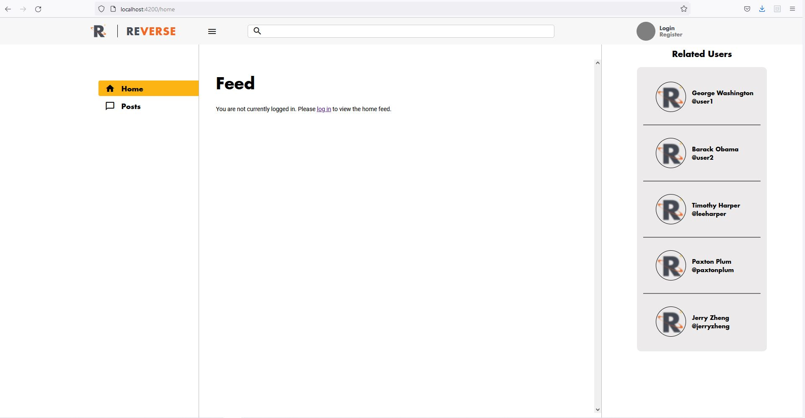

This project was generated with [Angular CLI](https://github.com/angular/angular-cli) version 12.2.8. 

## Description 
Reverse is an emergent social media application that helps Revature employees connect with their colleagues inside - and outside - of the workplace. Employees can create and customize their profiles, showcasing the professional achievements they'd like to celebrate with their peers via textual and visual posts. They can also encourage and advise their colleagues by "liking" and commenting on various posts as they appear in their curated Reverse news feeds.

## Technologies 
 - HTML5
 - CSS 
 - SCSS
 - Angular Material UI
 - TypeScript
 - Angular
 - Angular CLI  
 - Node.js
 - Dockerfile
 
## Components
### HomepageComponent 
-> This component contains the home page: the first thing the user sees on the site

This is the home page before logging in. The user has to regiser and log in before using the service. 

This is the home page after logging in.

### LoginRegisterComponent
-> This component provides a double tabbed form for the user to register and log in in the html template. We styled in with a galaxy background-image with color overlay.Images were used in the clickable tabled with a Revature graphic.

### UserComponent
--> Displays to the logged-in user their posts and related users and the navigation sidebar to edit their profile or add posts or like posts

### UserProfileEditComponent
-> This allows users to edit their profile or information.

### PostComponent & AddPostComponent
-> This component gives the ability to create and submit verses (posts), to like verses, and to create comments for these posts. 

This is the PostComponent

This is the AddPostComponent

### HeaderComponent
-> This provides the universal header with the search feature at the top of every component, the header for every page. 

### SidebarComponent
-> This provides the side-bar for navigating the site after logging in. 

### EditPostComponent
-> This allows users to edit their posts in case they want to erase any profanity which their is a filter for.

## Interceptors 
### LoadingScreenInterceptor 
-> Used to implement the loadding screen by intercepting Http requests and using the LoadingScreenService execute the loading screen when transitioning between component screens. 

### TokenInterceptor 
-> Used to intercept the Http Request to grab the JWT token for authentication and maintaining a log-in session 

## Getting Started
- git clone https://github.com/Revature-Reverse/Reverse-Angular.git and move into its folder
- If you are using a Windows terminal, consider running "Set-ExecutionPolicy -Scope Process -ExecutionPolicy Bypass" to be to run scripts
- Run `npm install` to install all dependencies. 
- Run `ng new project_name` to start a new project. 
- Run `ng serve` for a dev server. Navigate to `http://localhost:4200/`. The app will automatically reload if you change any of the source files.
- Create a new folder for the Discovery repo, move into this folder, and run `git clone https://github.com/Revature-Reverse/Discovery.git`
- Create a new folder for Gateway repo, move into this folder, and run `git clone https://github.com/Revature-Reverse/Gateway.git`
- Create a new folder for User-Service repo, move into this folder, and run `git clone https://github.com/Revature-Reverse/User-Service.git`
- Create a new folder for Post-Service repo, move into this folder, and run `git clone https://github.com/Revature-Reverse/Post-Service.git`
- Open your favored IDE and run the Discovery, GateWay, User-Service, and Post-Service (in this order)
